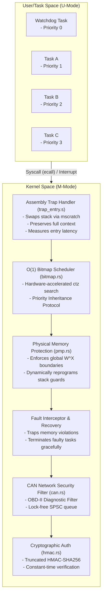

# Cerberus-OS Technical Architecture

Cerberus-OS is a bare-metal, high-integrity Real-Time Operating System (RTOS) microkernel written in Rust for 32-bit RISC-V targets. It acts as a secure partitioning layer for automotive Electronic Control Units (ECUs).

## System Layout

## Core Subsystems

### 1. Privilege & Execution Model
* **Privilege Separation**: The kernel executes in Machine Mode (M-Mode), while all application tasks execute in User Mode (U-Mode). 
* **W^X Policy**: We enforce a strict **Write XOR Execute** configuration at the CPU level. Using Physical Memory Protection (PMP), we configure Flash memory (Code segment) as Read+Execute, and SRAM memory (Data segment) as Read+Write. If any code attempts to execute from RAM or write to Flash, a hardware violation fault immediately triggers a system halt.
* **Kernel Interrupt Stack**: To prevent User-space stack overflows from corrupting the kernel, the `mscratch` register holds the secure `KERNEL_STACK` pointer. On trap entry, the kernel swaps stacks, executes the Rust handler on kernel memory, and swaps back before dropping privilege back to U-Mode.

### 2. Trap Handler Vector
* **Entry Path**: The `mtvec` register points to the entry vector in `src/trap_entry.s`.
* **Context Preservation**: On trap, the assembly saves all 32 integer registers to the user stack frame. It then reads the hardware cycle counter (`mcycle`) to calculate context preservation latency and calls the Rust `trap_handler`.
* **Preemption**: When a timer interrupt triggers, the handler re-arms the CLINT comparator (`mtimecmp`) and calls the scheduler. If a different task is ready, the stack pointer is swapped, restoring registers from the new task's stack.

### 3. O(1) Ready-Queue Scheduler
* **Design**: The ready queue is represented as a single `u32` bitmask where bit `N` is set if priority `N` is ready to run. 
* **Algorithm**: The next task is selected using `trailing_zeros()`, mapping to the single-cycle hardware `ctz` instruction. Selection time is completely independent of the number of ready tasks.
* **Priority Inheritance Protocol (PIP)**: To solve priority inversion, the scheduler temporarily boosts the priority of a low-priority task holding a mutex when a high-priority task blocks on the mutex, resolving resource deadlocks.

### 4. Hardware Exception Trapping & Recovery
* Synchronous exception causes (Instruction Access Fault `1`, Load Access Fault `5`, Store Access Fault `7`) are caught by the kernel trap handler. 
* Rather than panicking, the kernel terminates the offending task, marks it as `Terminated` in its TCB, clears its ready bit, and reschedules to healthy tasks (Task A, Task B, Watchdog Task).

### 5. CAN Stack and Cryptographic Authentication
* **Boundary Filtering**: Parses raw transceiver bytes, extracting IDs and data payloads. Rejects OBD-II diagnostic request packets (`0x7DF`) and ECU query ranges (`0x7E0`–`0x7EF`) at the boundary.
* **HMAC Signatures**: Appends a 64-bit truncated HMAC-SHA256 signature to payloads, ensuring authenticity over low-bandwidth buses.
* **Side-Channel Mitigation**: Verification uses a constant-time bitwise accumulator to avoid early-exit timing leaks.
