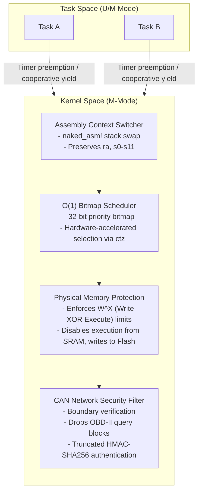

# Cerberus-OS Technical Architecture
Cerberus-OS is a bare-metal, high-integrity Real-Time Operating System (RTOS) kernel written in Rust for 32-bit RISC-V targets. It is designed to act as a secure kernel partition for automotive Electronic Control Units (ECUs).
## System Layout

## Core Subsystems
### 1. Privilege & Execution Model
- **Privilege Mode**: Runs in Machine mode (M-mode) to configure hardware-level registers (PMP, CLINT, MTVEC). 
- **W^X Policy**: We enforce a strict **Write XOR Execute** configuration at the CPU level. Using Physical Memory Protection (PMP), we configure Flash memory (Code segment) as Read+Execute, and SRAM memory (Data segment) as Read+Write. If any code attempts to execute from RAM or write to Flash, a hardware violation fault immediately triggers a system halt.
### 2. Trap Handler Vector
- **Entry Path**: The `mtvec` register points to the entry vector in `src/trap_entry.s`.
- **Context Preservation**: On trap, the assembly saves all 32 registers to a 128-byte stack frame. It then reads the hardware cycle counter (`mcycle`) to calculate context preservation latency and calls the Rust `trap_handler`.
- **Preemption**: When a timer interrupt triggers, the handler re-arms the CLINT comparator (`mtimecmp`) and calls the scheduler. If a different task is ready, the stack pointer is swapped, restoring registers from the new task's stack.
### 3. O(1) Bitmap Scheduler
- **Design**: The queue state is represented as a single `u32` bitmask where bit `N` is set if priority `N` is ready. 
- **Algorithm**: The next task is selected using `trailing_zeros()`, mapping to the single-cycle hardware `ctz` instruction. Selection time is completely independent of the number of ready tasks.
### 4. CAN Stack and Cryptographic Authentication
- **Boundary Parsing**: Parses raw transceiver bytes, extracting IDs and data payloads. Rejects OBD-II diagnostic request packets (`0x7DF`) at the boundary.
- **HMAC Signatures**: Appends a 64-bit truncated HMAC-SHA256 signature to payloads, ensuring authenticity over low-bandwidth buses.
- **Side-Channel Mitigation**: Verification uses a constant-time bitwise accumulator to avoid early-exit timing leaks.
