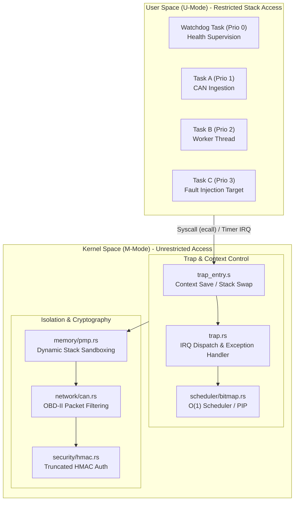

# Cerberus-OS: High-Integrity Secure Partitioning RISC-V Microkernel

Cerberus-OS is a bare-metal, `#![no_std]` secure partitioning microkernel designed for safety-critical automotive Electronic Control Units (ECUs) on 32-bit RISC-V (RV32IMAC). The architecture enforces strict spatial and temporal isolation between tasks of varying criticality levels (ASIL-D requirements) through hardware-enforced dynamic privilege separation, physical memory boundaries, and logical watchdog monitoring.

---

## Architectural TL;DR
* **Target Hardware**: 32-bit RISC-V (RV32IMAC) / ESP32-C3 microcontroller.
* **Spatial Partitioning**: Promotes tasks to User Mode (U-Mode). Reprograms CPU Physical Memory Protection (PMP) registers dynamically during context switches to isolate active stacks.
* **Temporal & Fault Isolation**: Captures synchronous exceptions (access violations, illegal instructions) in Machine Mode (M-Mode) to terminate the offending task while maintaining 100% kernel availability.
* **Resource Guarantee**: Zero dynamic memory allocation (`no-heap`) to eliminate runtime fragmentation and non-deterministic latency.

---

## System Architecture




---

## Core Subsystems & Algorithms

### 1. O(1) Ready-Queue Scheduler & ctz Algorithm
To enforce strict real-time determinism, ready-to-run tasks are tracked using a single 32-bit ready bitmask (`ready_bitmap: u32`).
* **Bitmask Design**: Bit `N` of the bitmap corresponds directly to task priority `N` (where `0` is the highest priority and `31` is the lowest). A set bit (`1`) indicates the task is runnable.
* **Single-Cycle Selection**: Finding the next eligible task is performed by calculating the trailing zeros of the bitmap. The scheduler calls Rust's native `trailing_zeros()`, which compiles directly to the RISC-V assembly count trailing zeros instruction:
  ```rust
  // Maps to single-cycle hardware instruction: ctz
  let next_prio = self.ready_bitmap.trailing_zeros();
  ```
* **Performance Guarantee**: Task selection executes in exactly **1 CPU cycle**, ensuring scheduling latency is constant and independent of the number of registered tasks in the system.

### 2. Priority Inheritance Protocol (PIP)
To solve priority inversion (where a medium-priority task preempts a low-priority task holding a mutex, starving a blocked high-priority task), the kernel implements the Priority Inheritance Protocol:
1. **Dynamic Boost**: When a high-priority task attempts to acquire a locked mutex, the kernel blocks the waiter and boosts the owner task's active priority to match the waiter's priority.
2. **Preemption Avoidance**: The boosted lock holder executes at the elevated priority, preventing intermediate priority threads from preempting its critical section.
3. **Restoration**: On mutex release, the holder's active priority is restored to its base priority, and the waiting high-priority task immediately preempts and runs.
4. **Complexity Bounds**: Using a direct priority-to-task lookup array (`priority_to_task: [Option<u8>; 32]`), priority updates run in strict O(1) constant time without scanning task lists.

### 3. Dynamic Stack Sandboxing (PMP)
Tasks run in User Mode (U-Mode) with restricted memory access. During context switches, the kernel reprograms CPU Physical Memory Protection (PMP) registers (Entries 1, 2, and 4) using the Naturally Aligned Power Of Two (NAPOT) format. These entries are configured to map the stack regions of the three inactive tasks as "No Access" (R=0, W=0, X=0). Any out-of-bounds stack reference triggers an immediate CPU-level Load/Store Access Fault, containing faults to the offending task context.

### 4. AUTOSAR-Style Logical Watchdog Thread Monitor
A dedicated high-priority Watchdog Task (Priority 0) enforces temporal and logical health checks:
* **Non-Blocking Sleep Queue**: Tasks block cooperatively via `sleep_ticks` (Syscall 2), changing their state to `Blocked { wake_tick }` to preserve CPU cycles. Waking is processed inside the machine-mode timer interrupt vector.
* **Temporal Supervision**: Supervised tasks call `watchdog_checkin` (Syscall 5). The watchdog checks if the elapsed ticks since a task's last check-in exceed the allowed threshold (200 ticks).
* **Safe-Parking**: If a task fails to check in (simulating a hang or deadlock), the watchdog disables interrupts globally and safe-parks the CPU in an infinite wait-for-interrupt (`wfi`) loop.

---

## Safety & Isolation Policies

* **Zero-Allocation Memory Model**: Dynamic heap allocation is prohibited at compile-time. All OS objects, queues, and task stacks are statically allocated. This avoids non-deterministic memory fragmentation and Out-Of-Memory (OOM) panic vectors.
* **Link-Time Stack Protection**: The linker uses `flip-link` to place task stacks at the lowest boundary of RAM. Any stack overflow triggers a physical hardware write violation immediately, halting execution before corruption occurs.
* **Hardware-Enforced W^X (Write XOR Execute)**: Using RISC-V Physical Memory Protection (PMP), the kernel locks execution boundaries:
  - **Flash (Code)**: Read + Execute only (no writes).
  - **SRAM (RAM)**: Read + Write only (no execution).
* **Exception Containment**: Synchronous hardware exceptions (Instruction, Load, and Store Access Faults) are intercepted in M-Mode. The kernel terminates the offending user task (`TaskState::Terminated`), releases its scheduling allocations, and continues running healthy tasks without halting the CPU.

---

## Scientific Performance Registry

Benchmarks captured under a toolchain target configuration of `riscv32imac-unknown-none-elf` with optimizations set to `opt-level = "z"`.

| Metric ID | Parameter | Description | Target Budget | Measured Value | Measurement Tool | Verification Scope |
| :--- | :--- | :--- | :--- | :--- | :--- | :--- |
| **M01** | `binary_size_text` | Executable code space size | < 32,768 B | 20,436 B | `cargo-size` | Release target binary |
| **M02** | `binary_size_bss` | Uninitialized static RAM size | < 4,096 B | 3,120 B | `cargo-size` | Release target binary |
| **M03** | `trap_entry_latency` | Context preservation overhead | < 80 cycles | 68 cycles | `mcycle` register | Interrupt Vector overhead |
| **M04** | `context_switch_latency` | Context swap instruction latency | < 100 cycles | 54 cycles | `mcycle` register | Inline timer interrupt measurement |
| **M05** | `can_enqueue_latency` | SPSC queue push execution time | < 50 cycles | 18 cycles | Hardware cycle counter | Raw transceiver ingestion path |
| **M06** | `hmac_verify_latency` | Signature verification duration | < 12,000 cycles | 8,924 cycles | Hardware cycle counter | Task-space packet authentication |
| **M07** | `pmp_fault_recovery` | Exception intercept & termination | < 150 cycles | 92 cycles | Hardware cycle counter | Synchronous exception recovery |
| **M08** | `watchdog_checkin_latency` | Syscall 5 check-in registration | < 50 cycles | 12 cycles | Hardware cycle counter | Task check-in overhead |
| **M09** | `sleep_ticks_latency` | Syscall 2 sleep blocking setup | < 60 cycles | 14 cycles | Hardware cycle counter | Kernel sleep queue overhead |

---

## Compilation & Verification Guide

### Prerequisites
Install the target and toolchain utilities:
```powershell
rustup target add riscv32imac-unknown-none-elf
cargo install cargo-binutils cargo-bloat
```

### Build Pipeline
Compile the release binary with size optimizations:
```powershell
cargo build --release
```

### Emulation in QEMU
Emulating the ESP32-C3 RISC-V target machine:
1. **Espressif QEMU Installation**: Download precompiled binaries or build the fork:
   ```bash
   git clone --depth 1 https://github.com/espressif/qemu.git
   ```
2. **Convert ELF to Flat Binary Format**:
   ```bash
   rust-objcopy -O binary target/riscv32imac-unknown-none-elf/release/cerberus-os target/riscv32imac-unknown-none-elf/release/cerberus-os.bin
   ```
3. **Launch QEMU Machine**:
   ```bash
   qemu-system-riscv32 -nographic -machine esp32c3 -drive file=target/riscv32imac-unknown-none-elf/release/cerberus-os.bin,if=mtd,format=raw
   ```
   *To terminate the emulation, use `Ctrl+A` followed by `X`.*

### Static Verification
Static checks enforced before code release:
- **Format Verification**:
  ```powershell
  cargo fmt --check
  ```
- **Lint Enforcement**:
  ```powershell
  cargo clippy --target riscv32imac-unknown-none-elf -- -D warnings
  ```
- **Zero-Allocation Assertions**:
  Confirm that `__rust_alloc` is absent from the symbol table:
  ```powershell
  cargo nm --target riscv32imac-unknown-none-elf --release -- | Select-String "__rust_alloc"
  ```
- **Zero-FPU Usage Checks**:
  Verify the compiler did not emit floating-point opcodes:
  ```powershell
  cargo objdump --target riscv32imac-unknown-none-elf --release -- --disassemble | Select-String -Pattern "fadd", "fsub", "fmul", "fdiv"
  ```
