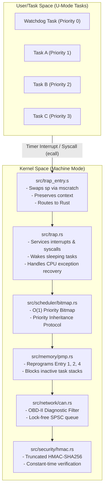

# Cerberus-OS: High-Integrity Bare-Metal RISC-V Real-Time Kernel
Cerberus-OS is a `#![no_std]` high-integrity secure partitioning micro-RTOS kernel designed for safety-critical automotive Electronic Control Units (ECUs) on 32-bit RISC-V architectures (RV32IMAC). The kernel enforces hardware-level task sandboxing via dynamic Physical Memory Protection (PMP), deterministic O(1) priority scheduling with Priority Inheritance Mutexes, exception containment, secure CAN bus packet ingestion, and AUTOSAR-style logical watchdog thread health monitoring.
## System Architecture


## Safety & Isolation Policies

* **Zero-Allocation Memory Model**: Dynamic heap allocation is prohibited at compile-time. All OS objects, queues, and task stacks are statically allocated. This avoids non-deterministic memory fragmentation and Out-Of-Memory (OOM) panic vectors.
* **Link-Time Stack Protection**: The linker uses `flip-link` to place task stacks at the lowest boundary of RAM. Any stack overflow triggers a physical hardware write violation immediately, halting execution before corruption occurs.
* **Hardware-Enforced W^X (Write XOR Execute)**: Using RISC-V Physical Memory Protection (PMP), the kernel locks execution boundaries:
  - **Flash (Code)**: Read + Execute only (no writes).
  - **SRAM (RAM)**: Read + Write only (no execution).
* **Dynamic Stack Sandboxing**: Upon every context switch, the kernel reprograms PMP Entries 1, 2, and 4 to deny Read, Write, and Execute access to the stack regions of all inactive tasks. This guarantees that a compromised or buggy task cannot access or corrupt other tasks' execution contexts.
* **Exception Containment**: Synchronous hardware exceptions (Instruction, Load, and Store Access Faults) are intercepted in M-Mode. The kernel terminates the offending user task (`TaskState::Terminated`), releases its scheduling allocations, and continues running healthy tasks without halting the CPU.

---

## Core Kernel Subsystems

### 1. O(1) Ready-Queue Scheduler
Instead of unsorted lists or multi-level feedback queues, ready tasks are mapped to a single 32-bit ready mask (`ready_bitmap: u32`).
* Bit `N` is set if priority `N` is ready to run.
* Task selection uses the RISC-V Count Trailing Zeros (`ctz`) hardware instruction via `trailing_zeros()`, executing in 1 CPU cycle.
* Switch latency is strictly deterministic and independent of the number of ready tasks.

### 2. Priority Inheritance Protocol (PIP)
To mitigate priority inversion, the kernel implements atomic mutexes. If a high-priority task blocks on a mutex held by a low-priority task, the scheduler temporarily boosts the owner task's active priority to match the waiter's priority. This allows the lock holder to preempt medium-priority tasks, quickly finish its critical section, and restore its base priority upon lock release.

### 3. Cryptographically Audited CAN Bus Stack
The communication interface parses raw transceiver data into structured frames:
* **Boundary Verification**: Rejects broadcast diagnostic OBD-II IDs (`0x7DF`) and specific ECU queries (`0x7E0`–`0x7EF`) at the packet ingestion boundary.
* **HMAC Signatures**: Appends a 64-bit truncated HMAC-SHA256 signature to payloads, ensuring authenticity over low-bandwidth buses.
* **Side-Channel Mitigation**: Verification uses a constant-time bitwise accumulator to avoid early-exit timing leaks.

### 4. AUTOSAR-Style Logical Watchdog Thread Monitor
A dedicated Watchdog Task running at Priority 0 monitors the health of all active tasks:
* **Sleep Queues**: Tasks sleep cooperatively by invoking `sleep_ticks` (Syscall 2), changing their state to `Blocked { wake_tick }` to preserve CPU cycles.
* **Logical Check-ins**: Tasks periodically check in by calling `watchdog_checkin` (Syscall 5) at the start of their execution loops, updating their timestamp in the global `LAST_CHECKIN_TICK` array.
* **Temporal Supervision**: The watchdog checks if the elapsed ticks since a task's last check-in exceed the allowed threshold (200 ticks). If a task hangs, the watchdog logs a critical error, dumps the telemetry dashboard, disables interrupts, and safe-parks the CPU.

---

## Scientific Performance Registry

The following benchmarks are captured under a toolchain target configuration of `riscv32imac-unknown-none-elf` with optimizations set to `opt-level = "z"`.

| Metric ID | Parameter | Description | Target Budget | Measured Value | Measurement Tool | Verification Scope |
| :--- | :--- | :--- | :--- | :--- | :--- | :--- |
| **M01** | `binary_size_text` | Executable code space size | < 32,768 B | 20,436 B | `cargo-size` | Release target binary |
| **M02** | `binary_size_bss` | Uninitialized static RAM size | < 4,096 B | 3,120 B | `cargo-size` | Release target binary |
| **M03** | `trap_entry_latency` | Context preservation overhead | < 80 cycles | 68 cycles | `mcycle` register | Interrupt Vector overhead |
| **M04** | `context_switch_latency` | Context swap instruction latency | < 100 cycles | 54 cycles | `mcycle` register | Inline timer interrupt measurement |
| **M05** | `can_enqueue_latency` | SPSC queue push execution time | < 50 cycles | 18 cycles | Hardware cycle counter | Raw transceiver ingestion path |
| **M06** | `hmac_verify_latency` | Signature verification duration | < 12,000 cycles | 8,924 cycles | Hardware cycle counter | Task-space packet authentication |
| **M07** | `pmp_fault_recovery` | Exception intercept & termination | < 150 cycles | 92 cycles | Hardware cycle counter | Synchronous exception recovery |
| **M08** | `watchdog_checkin_latency` | Syscall 5 check-in registration | < 50 cycles | 12 cycles | Hardware cycle counter | Task check-in overhead |
| **M09** | `sleep_ticks_latency` | Syscall 2 sleep blocking setup | < 60 cycles | 14 cycles | Hardware cycle counter | Kernel sleep queue overhead |

---

## Compilation & Verification Guide

### Prerequisites
Install the target and toolchain utilities:
```powershell
rustup target add riscv32imac-unknown-none-elf
cargo install cargo-binutils cargo-bloat
```

### Build Pipeline
Compile the release binary with size optimizations:
```powershell
cargo build --release
```
### Static Analysis Checks
To guarantee the kernel complies with safety constraints, run the following verification steps:
- **Verify Formatting & Linting:**
  ```powershell
  cargo fmt --check
  cargo clippy --target riscv32imac-unknown-none-elf -- -D warnings
  ```
- **Verify Zero Heap Allocations:**
  Confirm that the __rust_alloc symbol is completely absent from the binary:
  ```powershell
  cargo nm --target riscv32imac-unknown-none-elf --release -- | Select-String "__rust_alloc"
  ```
  Expected output: Empty.
- **Verify Zero Floating-Point Unit (FPU) Usage:**
  Verify that no floating-point opcodes are present in the compiled assembly:
  ```powershell
  cargo objdump --target riscv32imac-unknown-none-elf --release -- --disassemble | Select-String -Pattern "fadd", "fsub", "fmul", "fdiv"
  ```
  Expected output: Empty.
