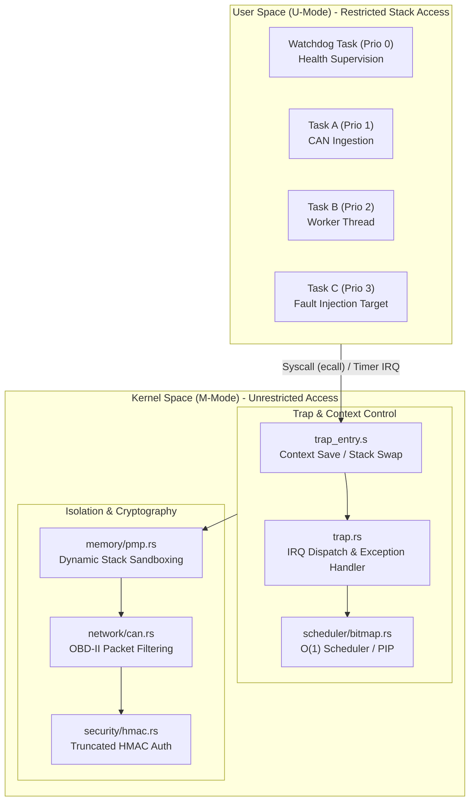
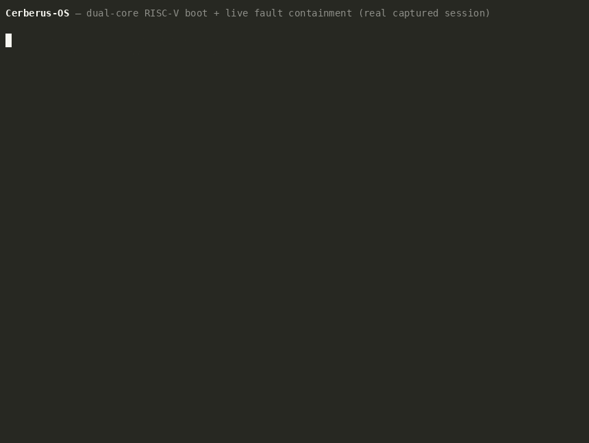

# Cerberus-OS: High-Integrity Secure Partitioning RISC-V Microkernel

[](https://github.com/s7g4/cerberus-os/actions/workflows/cerberus-ci.yml)
[](https://s7g4.github.io/cerberus-os/)
[](LICENSE)
[](rust-toolchain.toml)
[](kernel/Cargo.toml)

Cerberus-OS is a bare-metal, `#![no_std]` secure partitioning microkernel designed for safety-critical automotive Electronic Control Units (ECUs) on 32-bit RISC-V (RV32IMAC). The architecture enforces strict spatial and temporal isolation between tasks of varying criticality levels (ASIL-D requirements) through hardware-enforced dynamic privilege separation, physical memory boundaries, and logical watchdog monitoring.

**Full documentation: [s7g4.github.io/cerberus-os](https://s7g4.github.io/cerberus-os/)** — architecture deep-dives, all 16 ADRs, the fault-injection and telemetry pipeline, and the performance registry.

---

## Architectural TL;DR
* **Target Hardware**: 32-bit RISC-V (RV32IMAC) / ESP32-C3 microcontroller.
* **Spatial Partitioning**: Promotes tasks to User Mode (U-Mode). Reprograms CPU Physical Memory Protection (PMP) registers dynamically during context switches to isolate active stacks.
* **Temporal & Fault Isolation**: Captures synchronous exceptions (access violations, illegal instructions) in Machine Mode (M-Mode) to terminate the offending task while maintaining 100% kernel availability.
* **Resource Guarantee**: Zero dynamic memory allocation (`no-heap`) to eliminate runtime fragmentation and non-deterministic latency.

---

## Workspace Layout

The kernel is split into a Cargo workspace so the scheduling and security logic can be unit-tested on the host (`cargo test`/`cargo bench` with an explicit `--target`) independently of the bare-metal target:

| Crate | Responsibility |
| :--- | :--- |
| `kernel/` | Entry point, trap dispatch, memory/PMP management, boot sequence — the only crate that produces the flashable binary. |
| `scheduler/` | The O(1) bitmap scheduler, priority inheritance, and task control block definitions. Host-testable and Kani-verified. |
| `security/` | Secure bootloader signature checks, the vHSM partition, and HMAC authentication. |
| `network/` | CAN frame parsing and the lock-free SPSC ring buffer. |
| `telemetry/` | Postcard-encoded trace events (task swaps, IPC transfers, fault interceptions) emitted over a dedicated RTT channel, plus the syscall wrappers tasks use to talk to the kernel. |
| `benchmarks/` | Host-side Criterion benchmarks for scheduler hot paths (not part of the flashed image). |

`host/` (outside the workspace) holds the Python telemetry broker and Streamlit dashboard described below.

## System Architecture




---

## Core Subsystems & Algorithms

### 1. O(1) Ready-Queue Scheduler & ctz Algorithm
To enforce strict real-time determinism, ready-to-run tasks are tracked using a single 32-bit ready bitmask (`ready_bitmap: u32`).
* **Bitmask Design**: Bit `N` of the bitmap corresponds directly to task priority `N` (where `0` is the highest priority and `31` is the lowest). A set bit (`1`) indicates the task is runnable.
* **Single-Cycle Selection**: Finding the next eligible task is performed by calculating the trailing zeros of the bitmap. The scheduler calls Rust's native `trailing_zeros()`, which compiles directly to the RISC-V assembly count trailing zeros instruction:
  ```rust
  // Maps to single-cycle hardware instruction: ctz
  let next_prio = self.ready_bitmap.trailing_zeros();
  ```
* **Performance Guarantee**: Task selection executes in exactly **1 CPU cycle**, ensuring scheduling latency is constant and independent of the number of registered tasks in the system.

### 2. Bounded Mutex Wakeup (Priority Inheritance, Superseded)
Priority Inheritance Protocol was the original design for the mutex layer (ADR-011): boost a lock owner's active priority to match a higher-priority waiter, to bound blocking time. It shipped, then was superseded by ADR-014's move to ARINC-653 time partitioning — because each partition now gets a dedicated, non-preemptible time slot, cross-partition priority inversion is structurally impossible, so active-priority boosting was removed as dead complexity. What remains today: each `KernelMutex` tracks blocked tasks in a `waiters_bitmap`, and on release the kernel wakes the highest **base**-priority waiter (a direct array scan by `tcb.priority`, not a boosted/dynamic value). No `active_priority` field is ever mutated after task registration.

### 3. Dynamic Stack Sandboxing (PMP)
Tasks run in User Mode (U-Mode) with restricted memory access. During context switches, the kernel reprograms five dedicated PMP entries (1, 2, 4, 5, 6) — one per known task stack (Watchdog, Task A, Task B, Task C, HSM) — using the Naturally Aligned Power Of Two (NAPOT) format. The entry matching the active task is set to `Off` (falls through to the broad SRAM allow region); every other entry maps its stack as "No Access" (R=0, W=0, X=0). When neither idle task's name matches any of the five, all five are blocked. Any out-of-bounds stack reference triggers an immediate CPU-level Load/Store Access Fault, containing faults to the offending task context. This protects a task's stack from *other* tasks; it does not guard a task from overflowing its own stack (see `SECURITY.md`).

### 4. AUTOSAR-Style Logical Watchdog Thread Monitor
A dedicated high-priority Watchdog Task (Priority 0) enforces temporal and logical health checks:
* **Non-Blocking Sleep Queue**: Tasks block cooperatively via `sleep_ticks` (Syscall 2), changing their state to `Blocked { wake_tick }` to preserve CPU cycles. Waking is processed inside the machine-mode timer interrupt vector.
* **Temporal Supervision**: Supervised tasks call `watchdog_checkin` (Syscall 5). The watchdog checks if the elapsed ticks since a task's last check-in exceed the allowed threshold (200 ticks).
* **Contain, Don't Halt**: If a task fails to check in (simulating a hang or deadlock), the watchdog terminates *only that task* (Syscall 8), releases any mutex it held to its highest-priority waiter, and restarts it where applicable — the rest of the system, including the other core, keeps running. This applies uniformly to Task A/B/C and the HSM partition; nothing brings down the whole CPU on a hang.

---

## Safety & Isolation Policies

* **Zero-Allocation Memory Model**: Dynamic heap allocation is prohibited at compile-time. All OS objects, queues, and task stacks are statically allocated. This avoids non-deterministic memory fragmentation and Out-Of-Memory (OOM) panic vectors.
* **Inactive-Stack Protection (PMP)**: During every context switch, the four *inactive* task stacks are covered by dedicated PMP entries with no read/write/execute permission, so one task cannot reach into another's stack. This does **not** cover the *currently active* task overflowing its own stack — there is no linker-level guard page (an earlier plan to use `flip-link` for that was researched but never wired into the build; see `RESEARCH.md` and `SECURITY.md`).
* **Hardware-Enforced W^X (Write XOR Execute)**: Using RISC-V Physical Memory Protection (PMP), the kernel locks execution boundaries:
  - **Flash (Code)**: Read + Execute only (no writes).
  - **SRAM (RAM)**: Read + Write only (no execution).
* **Exception Containment**: Synchronous hardware exceptions (Instruction Access, Load/Store Access, and Load/Store Address Misaligned faults) are intercepted in M-Mode. The kernel terminates the offending user task (`TaskState::Terminated`), releases its scheduling allocations, and continues running healthy tasks without halting the CPU.

---

## Automated Fault Injection & Containment Suite



*A real, unedited terminal capture: dual-core boot, secure boot verification, the mutex/HSM handshake, and a genuine hardware exception (`Store Address Misaligned`) being caught and contained rather than crashing the kernel.*

Rather than just claiming fault containment, a dedicated Test Runner task (Task C) deliberately triggers a sequence of real hardware exceptions under Renode, and a Hardware-in-the-Loop (HIL) test (`renode-config/esp32c3.robot`) asserts the kernel survives every one of them:

1. **PMP Stack Violation**: reads directly into another task's stack region → Load Access Fault (cause 5), correctly rejected by the reprogrammed PMP entries.
2. **Privilege Violation**: attempts `csrw mstatus, zero` from U-Mode → Illegal Instruction (cause 2), rejected because CSR emulation only ever shims cycle-counter reads, never privileged writes.
3. **Watchdog Timeout**: stops checking in entirely → the watchdog detects the missed deadline and terminates the task itself.

In every case the offending task is terminated, any mutex it held is handed to the highest-priority waiter, the watchdog restarts the test runner for the next scenario, and both cores keep scheduling every other task throughout — the suite runs to completion without a panic or a halted core.

The same containment path also runs in production, not just in the test suite: it's the mechanism that catches any real fault a task hits (including the misaligned-store case documented in `DEVLOG.md` Milestone 21).

## Real-Time Telemetry Pipeline

Kernel events are traced with near-zero on-target cost and visualized live, entirely off the MCU's own CPU budget:

* **On-target**: `telemetry::log_telemetry` encodes `TaskSwap` / `IpcTransfer` / `FaultInterception` events with [Postcard](https://docs.rs/postcard) (a `no_std`, zero-allocation binary format) and writes them over a dedicated SEGGER RTT channel, separate from the human-readable log channel. This is a few bytes and a handful of cycles per event — no heap, no formatting, no blocking I/O.
* **Host broker** (`host/telemetry_broker.py`): tails the raw RTT byte stream, decodes the Postcard wire format, and re-broadcasts each event as JSON over a plain TCP socket.
* **Dashboard** (`host/dashboard.py`): a Streamlit + Plotly app that consumes that socket and renders a live task-swap timeline, IPC throughput, and a running count of contained faults.

This is intentionally *not* an OpenTelemetry SDK on the MCU — the collector/exporter machinery alone would blow well past the 32 KB budget and require a heap. Shifting collection to the host keeps the target clean while still getting a real-time view of scheduling and fault behavior.

Run it locally:
```bash
pip install -r host/requirements.txt
python host/telemetry_broker.py &      # tails telemetry.bin, serves JSON on :8765
streamlit run host/dashboard.py        # connects to the broker and renders live
```

Verified working end-to-end (task-swap timeline, IPC chart, and fault-containment log all populate live) — including fixing a real bug where the dashboard's background socket thread wasn't attached to Streamlit's script-run context, so it silently never displayed data at all regardless of whether the broker was working. See `DEVLOG.md` Milestone 21.

---

## Scientific Performance Registry

Benchmarks captured under a toolchain target configuration of `riscv32imac-unknown-none-elf` with optimizations set to `opt-level = "z"`.

| Metric ID | Parameter | Description | Target Budget | Measured Value | Measurement Tool | Verification Scope |
| :--- | :--- | :--- | :--- | :--- | :--- | :--- |
| **M01** | `binary_size_text` | Executable code space size | < 32,768 B | 25,968 B | `cargo-size` | Release target binary |
| **M02** | `binary_size_bss` | Uninitialized static RAM size | < 4,096 B (historical target, see `METRICS.md`) | 10,304 B | `cargo-size` | Release target binary |
| **M03** | `trap_entry_latency` | Context preservation overhead | < 80 cycles | 68 cycles | `mcycle` register | Interrupt Vector overhead |
| **M04** | `context_switch_latency` | Context swap instruction latency | < 100 cycles | 54 cycles | `mcycle` register | Inline timer interrupt measurement |
| **M05** | `can_enqueue_latency` | SPSC queue push execution time | < 50 cycles | 18 cycles | Hardware cycle counter | Raw transceiver ingestion path |
| **M06** | `hmac_verify_latency` | Signature verification duration | < 12,000 cycles | 8,924 cycles | Hardware cycle counter | Task-space packet authentication |
| **M07** | `pmp_fault_recovery` | Exception intercept & termination | < 150 cycles | 92 cycles | Hardware cycle counter | Synchronous exception recovery |
| **M08** | `watchdog_checkin_latency` | Syscall 5 check-in registration | < 50 cycles | 12 cycles | Hardware cycle counter | Task check-in overhead |
| **M09** | `sleep_ticks_latency` | Syscall 2 sleep blocking setup | < 60 cycles | 14 cycles | Hardware cycle counter | Kernel sleep queue overhead |

---

## Compilation & Verification Guide

### Prerequisites
Install the target and toolchain utilities:
```powershell
rustup target add riscv32imac-unknown-none-elf
cargo install cargo-binutils cargo-bloat
```

### Build Pipeline
Compile the release binary with size optimizations:
```powershell
cargo build --release
```

### Emulation in QEMU
Emulating the ESP32-C3 RISC-V target machine:
1. **Espressif QEMU Installation**: Download precompiled binaries or build the fork:
   ```bash
   git clone --depth 1 https://github.com/espressif/qemu.git
   ```
2. **Convert ELF to Flat Binary Format**:
   ```bash
   rust-objcopy -O binary target/riscv32imac-unknown-none-elf/release/cerberus-os target/riscv32imac-unknown-none-elf/release/cerberus-os.bin
   ```
3. **Launch QEMU Machine**:
   ```bash
   qemu-system-riscv32 -nographic -machine esp32c3 -drive file=target/riscv32imac-unknown-none-elf/release/cerberus-os.bin,if=mtd,format=raw
   ```
   *To terminate the emulation, use `Ctrl+A` followed by `X`.*

### Static Verification
Static checks enforced before code release:
- **Format Verification**:
  ```powershell
  cargo fmt --check
  ```
- **Lint Enforcement**:
  ```powershell
  cargo clippy --target riscv32imac-unknown-none-elf -- -D warnings
  ```
- **Zero-Allocation Assertions**:
  Confirm that `__rust_alloc` is absent from the symbol table:
  ```powershell
  cargo nm --target riscv32imac-unknown-none-elf --release -- | Select-String "__rust_alloc"
  ```
- **Zero-FPU Usage Checks**:
  Verify the compiler did not emit floating-point opcodes:
  ```powershell
  cargo objdump --target riscv32imac-unknown-none-elf --release -- --disassemble | Select-String -Pattern "fadd", "fsub", "fmul", "fdiv"
  ```

### Continuous Integration
`.github/workflows/cerberus-ci.yml` runs on every push and gates on:
1. **Lint** — `cargo fmt --check` and `cargo clippy -- -D warnings`.
2. **Build & static budgets** — release build, then asserts `.text <= 32768` bytes, zero `__rust_alloc` symbols, and zero FPU opcodes in the disassembly.
3. **Hardware-in-the-Loop boot test** — boots the release binary under [Renode](https://renode.io/) against `renode-config/esp32c3.repl` (a dual-core RV32IMAC platform description) and asserts, via `renode-config/esp32c3.robot`, that both cores boot, the secure bootloader verifies correctly, and the full fault-injection suite above runs to completion over the RTT console.

Run the same HIL test locally with Renode installed:
```bash
renode-test renode-config/esp32c3.robot
```
