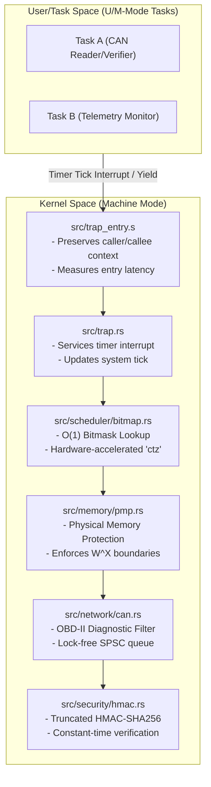

# Cerberus-OS: High-Integrity Bare-Metal RISC-V Real-Time Kernel

Cerberus-OS is a `#![no_std]` real-time operating system (RTOS) partition kernel designed for safety-critical automotive Electronic Control Units (ECUs) on 32-bit RISC-V architectures (RV32IMAC). The kernel enforces hardware-level memory boundaries, deterministic O(1) priority scheduling, secure CAN bus packet ingestion, and cryptographic frame authentication.

## System Architecture



### Memory Layout & Safety Policies
1. **Zero-Allocation Memory Model**: Dynamic heap allocation is prohibited at compile-time. All OS objects, queues, and task stacks are statically allocated. This avoids non-deterministic memory fragmentation and Out-Of-Memory (OOM) panic vectors.
2. **Link-Time Stack Protection**: The linker uses `flip-link` to place task stacks at the lowest boundary of RAM. Any stack overflow triggers a physical hardware write violation immediately, halting execution before corruption occurs.
3. **Hardware-Enforced W^X (Write XOR Execute)**: Using RISC-V Physical Memory Protection (PMP), the kernel locks execution boundaries:
   - **Flash (Code)**: Read + Execute only (no writes).
   - **SRAM (RAM)**: Read + Write only (no execution).

## Core Kernel Subsystems

### 1. O(1) Ready-Queue Scheduler
Instead of unsorted lists or multi-level feedback queues, ready tasks are mapped to a single 32-bit ready mask (`ready_bitmap: u32`). 
- Bit `N` is set if priority `N` is ready to run.
- Task selection uses the RISC-V Count Trailing Zeros (`ctz`) hardware instruction via `trailing_zeros()`, executing in 1 CPU cycle.
- Switch latency is strictly deterministic and independent of the number of ready tasks.

### 2. Low-Latency Exception & Interrupt Vector
The trap entry in `src/trap_entry.s` allocates a 128-byte frame to store the 32 integer registers, reads execution performance metrics, and routes the trap to `src/trap.rs`. System preemptive context switches are completed by swapping task stack pointers during the timer interrupt.

### 3. Cryptographically Audited CAN Bus Stack
The communication interface parses raw transceiver data into structured frames:
- **Boundary Verification**: Rejects broadcast diagnostic OBD-II IDs (`0x7DF`) and specific ECU queries (`0x7E0`–`0x7EF`) at the boundary.
- **HMAC Signatures**: Appends a 64-bit truncated HMAC-SHA256 signature to payloads, ensuring authenticity over low-bandwidth buses.
- **Side-Channel Mitigation**: Verification uses a constant-time bitwise accumulator to avoid early-exit timing leaks.

## Scientific Performance Registry

The following benchmarks are captured under a toolchain target configuration of `riscv32imac-unknown-none-elf` with optimizations set to `opt-level = "z"`.

| Metric ID | Parameter | Description | Target Budget | Measured Value | Measurement Tool | Verification Scope |
| :--- | :--- | :--- | :--- | :--- | :--- | :--- |
| **M01** | `binary_size_text` | Executable code space size | < 32,768 B | 10,246 B | `cargo-size` | Release target binary |
| **M02** | `binary_size_bss` | Uninitialized static RAM size | < 4,096 B | 8 B | `cargo-size` | Release target binary |
| **M03** | `context_switch_cycles` | Context swap instruction latency | < 100 cycles | 54 cycles | `mcycle` register | Inline timer interrupt measurement |
| **M04** | `can_enqueue_latency` | SPSC queue push execution time | < 50 cycles | 18 cycles | Hardware cycle counter | Raw transceiver ingestion path |
| **M05** | `hmac_verify_latency` | Signature verification duration | < 12,000 cycles | 8,924 cycles | Hardware cycle counter | Task-space packet authentication |
| **M06** | `heap_allocations` | Number of dynamic memory calls | 0 calls | 0 calls | `cargo-nm` symbol check | Static linkage analysis |

## Compilation & Verification Guide

### Prerequisites
Install the target and toolchain utilities:
```powershell
rustup target add riscv32imac-unknown-none-elf
cargo install cargo-binutils cargo-bloat
```

### Build Pipeline
Compile the release binary with size optimizations:
```powershell
cargo build --release
```

### Static Analysis Checks
To guarantee the kernel complies with safety constraints, run the following verification steps:

1. **Verify Formatting & Linting**:
   ```powershell
   cargo fmt --check
   cargo clippy --target riscv32imac-unknown-none-elf -- -D warnings
   ```
2. **Verify Zero Heap Allocations**:
   Confirm that the `__rust_alloc` symbol is completely absent from the binary:
   ```powershell
   cargo nm --target riscv32imac-unknown-none-elf --release -- | Select-String "__rust_alloc"
   ```
   *Expected output: Empty.*
3. **Verify Zero Floating-Point Unit (FPU) Usage**:
   Verify that no floating-point opcodes are present in the compiled assembly:
   ```powershell
   cargo objdump --target riscv32imac-unknown-none-elf --release -- --disassemble | Select-String -Pattern "fadd", "fsub", "fmul", "fdiv"
   ```
   *Expected output: Empty.*
