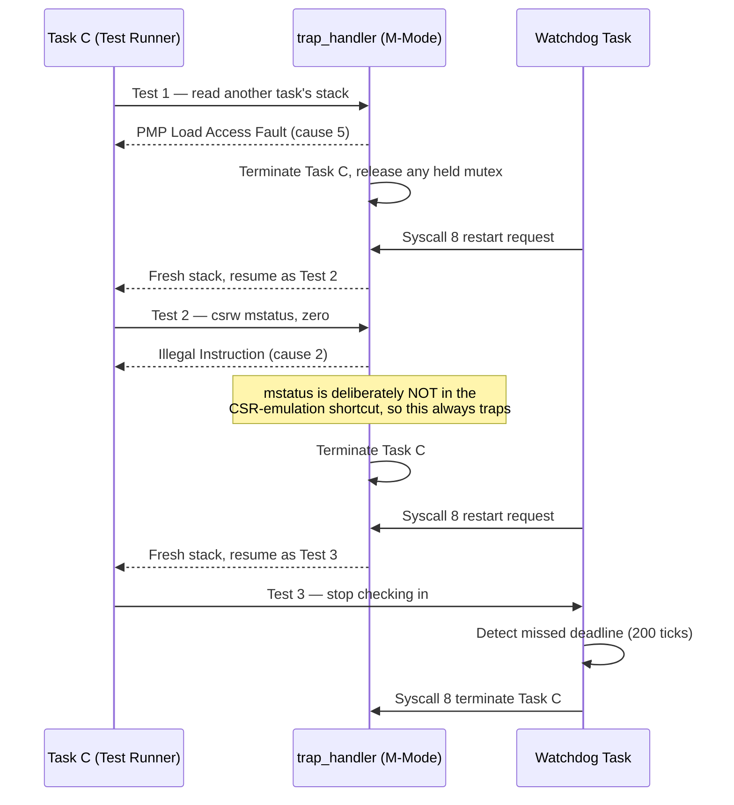

# Fault Injection & Telemetry

This page goes one level deeper than the README summary — it walks through what actually happens on the wire during the automated fault-injection suite, and how the telemetry pipeline observes it.


## The Fault Injection Sequence

The suite runs as a normal task (Task C, priority 3) rather than a special test harness bolted onto the kernel — from the scheduler's point of view it's just another partition, which is the point: containment has to work without any test-specific carve-outs.



Every one of these is a **real hardware exception**, not a simulated code path — the CPU genuinely takes a trap, `mcause` genuinely reads 5 or 2, and the containment logic in `trap.rs` genuinely runs the same code it would run for an unplanned fault in production.

### Why cause 2 (Illegal Instruction) needed a second look

Test 2 exists specifically to prove a *privilege* violation is caught, not just a *memory* violation. The kernel also lets U-mode tasks read the `cycle`/`mcycle` CSRs directly (trapped and silently emulated, since that's a legitimate profiling need used throughout the task code for `(Overhead: N cycles)` measurements). Early in this project's life, that emulation shortcut also matched `mstatus` (CSR `0x300`) — which meant Test 2's deliberate `csrw mstatus, zero` was quietly absorbed as if it were a harmless counter read, and the test always silently "passed" without ever exercising real containment. Narrowing the shortcut to only the two counter CSRs closed that gap; see `DEVLOG.md` Milestone 21 for the full account.

## Telemetry Wire Format

Every `TraceEvent` is Postcard-encoded and written to RTT channel 1 (channel 0 carries human-readable `defmt` text, so the two never interleave):

```rust
pub enum TraceEvent {
    TaskSwap { from: u8, to: u8, cycles: u32 },
    IpcTransfer { endpoint: u8, bytes: u8 },
    FaultInterception { cause: u32, pc: u32 },
}
```

The host broker (`host/telemetry_broker.py`) decodes Postcard's varint framing directly (no dependency on the `postcard` Python bindings — it's a small, self-contained varint reader) and re-broadcasts each event as JSON to any connected dashboard client over a plain TCP socket on port 8765.

## Why Not OpenTelemetry

The honest answer is budget: an OTel SDK on the MCU needs a collector/exporter pipeline, a network stack, and typically a heap — all things this kernel explicitly refuses to carry (see ADR-001). Moving collection entirely to the host, and keeping the on-target format to "a few bytes over RTT," was the only way to get real-time observability without blowing the 32 KB `.text` budget or introducing non-deterministic allocation. The dashboard (`host/dashboard.py`) gets the same *practical* value — a live view of scheduling, IPC, and faults — without paying that cost on the target.
